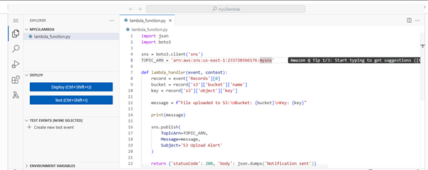
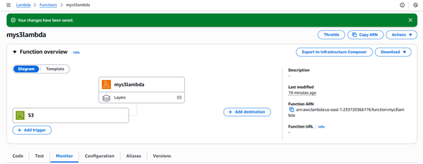
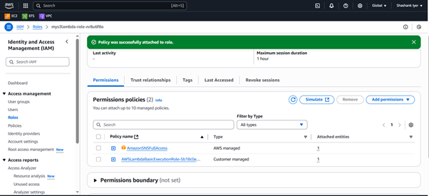
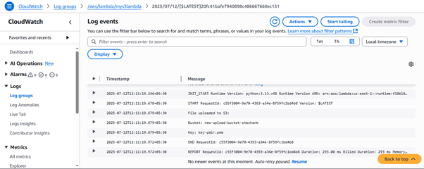

# 📦 Lambda Integration with S3 and SNS (SMS Notification)

*This guide explains how to trigger an AWS Lambda function when a new object is uploaded to an S3 bucket. The Lambda function then sends an SMS notification using Amazon SNS.*

## 🔧 Services Used

- Amazon S3 – for object storage and triggering events

- AWS Lambda – for serverless backend logic

- Amazon SNS – to send SMS notifications

### 🚀 Use Case

**Whenever a file is uploaded to an S3 bucket:**

Lambda is triggered

Lambda logs the file upload

Lambda sends an SMS via SNS with upload details

---

**Steps:**

**🛠️ Step 1: Create an S3 Bucket**

- Go to the Amazon S3 Console

- Click Create bucket

- Fill in:

- Bucket name: my-upload-bucket (or any unique name)

- Uncheck Block all public access if public access is needed (not required for this setup)

- Click Create bucket

✅ Your S3 bucket is now ready to trigger events on file uploads.

---

**🛠️ Step 2: Create SNS Topic and Subscribe for SMS**

- Go to the SNS Console

- Click Topics → Create topic

- Type: Standard

- Name: s3-upload-topic

- Click Create topic

- Click on the created topic → Create subscription

- Protocol: SMS

- Endpoint: +91XXXXXXXXXX (your mobile number)

- Click Create subscription

- ✅ You will receive a test SMS to confirm.

---

**🛠️ Step 3: Create Lambda Function**

- Go to the Lambda Console

- Click Create function

- Author from scratch

- Function name: S3UploadNotifier

- Runtime: Python 3.12

- Permissions: Create new role with basic Lambda permissions

- Click Create function

- Paste the following code into the Function code section:

```
import json
import boto3

sns = boto3.client('sns')
TOPIC_ARN = 'arn:aws:sns:us-east-1:YOUR_ACCOUNT_ID:s3-upload-topic'

def lambda_handler(event, context):
    record = event['Records'][0]
    bucket = record['s3']['bucket']['name']
    key = record['s3']['object']['key']
    
    message = f"File uploaded to S3:\nBucket: {bucket}\nKey: {key}"
    
    print(message)

    sns.publish(
        TopicArn=TOPIC_ARN,
        Message=message,
        Subject='S3 Upload Alert'
    )

    return {'statusCode': 200, 'body': json.dumps('Notification sent')}

```

*📌 Replace YOUR_ACCOUNT_ID with your actual AWS account ID and SNS topic name*

- Click Deploy



---

**🛠️ Step 4: Add S3 Trigger to Lambda**

- In the Lambda Function page, scroll to Function overview

- Click + Add trigger

- Trigger type: S3

- Bucket: Select the bucket you created earlier

- Event type: PUT

- Leave prefix/suffix blank unless filtering is required

- Check Enable trigger

- Click Add



---

**🛠️ Step 5: Add SNS Publish Permissions to Lambda Role**

- Go to the IAM Console

- Click Roles → Find the Lambda role (e.g., lambda-role-xxxxx)

- Click Add permissions → Attach policies

- Search and attach AmazonSNSFullAccess

- Click Add permissions



---

**✅ Testing the Setup**

- Go to the S3 Console

- Upload a file to the bucket you connected to Lambda

- Verify:

- ✅ CloudWatch Logs show Lambda execution



- ✅ SMS received on your mobile with bucket/object details